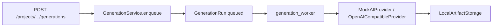

# Architecture Baseline Report — Phase 0

**Status:** Official migration baseline  
**Date (UTC):** 2026-07-24T09:51:46Z  
**Scope:** Ember AI Website Builder — generation stack and related API  
**Phase 0 actions:** Inventory + validation only. No production code changes. No refactors. No renames. No moves. No new agents. No new tests (existing suite sufficient).

---

## 1. Current folder tree

### Repository (top level)

```
AI Builder/
├── apps/
│   ├── api/                 # FastAPI backend + generation engine
│   └── web/                 # Vite + React frontend
├── checkpoints/             # TinyGPT weights
├── datasets/
├── docs/
│   ├── architecture/        # This baseline lives here
│   └── ml/
├── ml/                      # TinyGPT train / serve / eval (out of runtime agent scope)
├── package.json
└── docker-compose.yml
```

### API application (`apps/api/app/`)

```
app/
├── main.py
├── ai_model/
│   ├── classifier.py
│   └── trainer.py
├── api/v1/
│   ├── router.py
│   ├── ai.py
│   ├── auth.py
│   ├── downloads.py
│   ├── files.py
│   ├── generate.py
│   ├── preview.py
│   └── projects.py
├── core/
│   ├── config.py
│   ├── deps.py
│   └── security.py
├── db/
├── domain/
├── generation/
│   ├── engine.py                 # GenerationEngine (sync orchestrator)
│   ├── pipeline.py               # Shared DTOs
│   ├── ai/
│   │   ├── tinygpt_client.py
│   │   └── ai_planner.py
│   ├── analyzer/
│   │   ├── prompt_analyzer.py
│   │   └── website_types.py
│   ├── dependency/
│   │   └── dependency_manager.py
│   ├── edit/
│   │   └── edit_mode.py
│   ├── engines/                  # v2 helpers (theme/content/image/component)
│   ├── extractor/
│   │   └── requirements.py
│   ├── generators/               # Templates + specialty sites
│   ├── planner/
│   │   ├── website_planner.py
│   │   ├── project_planner.py
│   │   ├── folder_planner.py
│   │   └── niches.py
│   ├── preview/
│   │   └── preview_engine.py
│   ├── understanding/
│   │   └── intent_guards.py
│   └── validation/
│       ├── validator.py
│       └── semantic_validator.py
├── models/
├── providers/
│   ├── ai/                       # Worker-path Mock / OpenAI providers
│   └── storage/
├── schemas/
├── services/
└── workers/
    └── generation_worker.py
```

---

## 2. Current dependency graph

Primary sync path (`POST /api/v1/generate`):

```mermaid
flowchart TD
  API["api/v1/generate.py"] --> GE["GenerationEngine"]
  GE --> PA["PromptAnalyzer"]
  PA --> CL["LocalWebsiteClassifier"]
  PA --> IG["intent_guards"]
  GE --> TG1["tinygpt_client.fetch_tagline"]
  GE --> RE["RequirementExtractor"]
  GE --> WP["WebsitePlanner"]
  WP --> NI["niches.resolve_niche"]
  GE --> PP["ProjectPlanner"]
  GE --> FP["FolderPlanner"]
  GE --> CG["ComponentGenerator"]
  CG --> SP["Specialty generators"]
  CG --> LEG["Legacy templates in component_generator"]
  CG --> TG2["tinygpt_client hybrid overlay"]
  GE --> CSS["CssGenerator"]
  CSS --> TE["ThemeEngine"]
  GE --> RG["RouterGenerator"]
  GE --> AG["ApiGenerator"]
  GE --> DM["DependencyManager"]
  GE --> CE["ContentEngine"]
  GE --> IE["ImageEngine"]
  GE --> CompE["ComponentEngine"]
  GE --> GV["GenerationValidator"]
  GE --> SV["SemanticValidator"]
  GE --> EM["EditModeService"]
  GE --> ST["LocalArtifactStorage"]
  GE --> DB["SQLAlchemy models"]
  GE --> PE["PreviewEngine"]
  PE --> NPM["npm install / vite build"]
```



Parallel async path (not unified with Engine):



---

## 3. Current execution flow

### Sync generate (primary product path)

1. Authenticated `POST /api/v1/generate` with prompt (+ optional project id/name).
2. `GenerationEngine.run`:
   - Detect edit vs full generate.
   - `PromptAnalyzer.analyze` → optional TinyGPT tagline into SEO.
   - `RequirementExtractor.extract`.
   - Resolve/create `Project` + `GenerationRun`.
   - If any `gen_v2_*` planner/theme/content/images/components/validator flags: `WebsitePlanner.plan_from_analysis`.
   - Full pipeline: `ProjectPlanner` → scaffold → `ComponentGenerator` (± specialty / TinyGPT) → CSS / router / API / package.json → optional Content/Image/Component engines → validators → optional one regenerate.
   - Persist files to artifact storage + DB rows.
   - `PreviewEngine.sync_from_storage` + `install_and_build`.
3. Return JSON with project/run ids, analysis, validation, preview URL.

### Analyze-only

- `POST /api/v1/analyze` → `analyze_prompt` (no persist).
- `GET /api/v1/analyze/catalog` → website type catalog stats.

### Async queue path

- `POST /api/v1/projects/{id}/generations` → `GenerationService` marks run queued.
- Worker claims run → `provider.generate_site` → persist (bypasses specialty niche stack).

---

## 4. Inventory counts

| Metric | Count | Notes |
|--------|------:|-------|
| **Python modules under `app/` (excl. `__init__.py`)** | 71 | Application code units |
| **Python files under `app/` (incl. `__init__.py`)** | 94 | Full package file count |
| **Generators** | 13 | Files in `generation/generators/` excl. `__init__.py` |
| **Planners** | 4 | `website_planner`, `project_planner`, `folder_planner`, `niches` (+ optional `ai_planner` outside `planner/`) |
| **Analyzers** | 2 | `prompt_analyzer`, `website_types` (1 class: `PromptAnalyzer`) |
| **API route handlers (`/api/v1`)** | 24 | Plus root `GET /health` |
| **Worker modules** | 1 | `workers/generation_worker.py` (plus empty `__init__.py`) |
| **Test files** | 9 | `tests/test_*.py` |
| **Collected tests** | 31 | pytest collect |

### Generator breakdown (13)

| Kind | Modules |
|------|---------|
| Dispatch / shells | `component_generator`, `css_generator`, `router_generator`, `api_generator` |
| Specialty | `luxury_fashion`, `footwear`, `bookstore`, `electronics`, `blog`, `dev_portfolio`, `saas_product` |
| Unused (delete candidates for Phase 1) | `react_generator`, `tailwind_generator` |

### Planner breakdown (4 in `planner/` + 1 optional)

| Module | Role |
|--------|------|
| `website_planner.py` | `WebsitePlan` source of truth |
| `niches.py` | Niche registry + resolve |
| `project_planner.py` | Legacy `ProjectPlan` routes |
| `folder_planner.py` | Folder layout sketch |
| `ai/ai_planner.py` | Optional LLM enrich (`gen_v2_ai_planner`, default off) |

### Analyzer breakdown (2)

| Module | Role |
|--------|------|
| `prompt_analyzer.py` | Prompt → `PromptAnalysis` |
| `website_types.py` | Catalog of website types |

### API routes (24 under `/api/v1`)

| Router file | Handlers |
|-------------|----------|
| `generate.py` | 3 |
| `auth.py` | 3 |
| `projects.py` | 7 |
| `files.py` | 4 |
| `preview.py` + `live_router` | 4 |
| `downloads.py` | 1 |
| `ai.py` | 2 |

---

## 5. Feature flags (defaults from `app/core/config.py`)

Resolved at baseline run from local settings (`.env` may override):

| Flag | Default in code | Resolved at baseline |
|------|-----------------|----------------------|
| `generation_pipeline` | `"legacy"` | `"legacy"` |
| `gen_v2_planner` | `True` | `True` |
| `gen_v2_theme` | `True` | `True` |
| `gen_v2_components` | `True` | `True` |
| `gen_v2_content` | `True` | `True` |
| `gen_v2_validator` | `True` | `True` |
| `gen_v2_images` | `True` | `True` |
| `gen_v2_ai_planner` | `False` | `False` |
| `tinygpt_hybrid` | `True` | `True` |
| `tinygpt_base_url` | `http://127.0.0.1:8100` | same |
| `tinygpt_timeout_seconds` | `45.0` | `45.0` |
| `ai_mock` | `True` | `True` |
| `ai_provider` | `"local"` | `"local"` |

**Note:** Even with `generation_pipeline=legacy`, several `gen_v2_*` flags are on, so WebsitePlan + niche specialty dispatch are active on the sync Engine path.

---

## 6. Build status

| Check | Result |
|-------|--------|
| Web production build (`npm run build` → `tsc -b && vite build`) | **PASS** (2026-07-24) |
| API import (`from app.main import app`) | **PASS** |
| Production source edits in Phase 0 | **None** |

---

## 7. Test status

| Check | Result |
|-------|--------|
| Command | `cd apps/api && .venv/bin/python -m pytest -q` |
| Outcome | **31 passed**, 120 warnings (NumPy/joblib deprecation from classifier pickle) |
| New baseline tests added | **No** (existing suite sufficient) |

### Test files

- `test_bookstore.py`
- `test_dev_portfolio.py`
- `test_explicit_pages.py`
- `test_theme_engine.py`
- `test_v2_engines.py`
- `test_velora_clothing.py`
- `test_video_saas.py`
- `test_vishu_creation.py`
- `test_website_planner.py`

---

## 8. Known architectural risks (frozen for later phases)

1. **Dual generation paths:** `GenerationEngine` (sync `/generate`) vs worker + Mock/OpenAI (`/projects/.../generations`).
2. **Dead modules:** `react_generator.py`, `tailwind_generator.py` (unused imports).
3. **Dual plans:** `WebsitePlan` and `ProjectPlan` both drive routing/codegen.
4. **TinyGPT hybrid** soft-fails; specialty niches skip overlay.
5. **Quality loop** is validate + one regenerate, not a real fix agent.

---

## 9. Phase 0 completion record

| Item | Status |
|------|--------|
| Zero production code changes | Done |
| Zero renames / moves / agents | Done |
| Existing tests run | 31 passed |
| Web build run | Passed |
| Architecture Baseline Report | This document |

**Next phase (not started):** Phase 1 — delete unused `ReactGenerator` / `TailwindGenerator` (requires separate approval).
